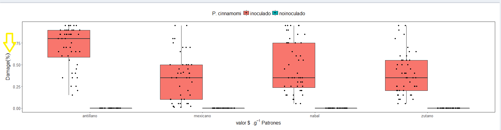

# Exploratory Graphic

Aquí se visualizan los valores atípicos, y permite al investigador tomar desiciones, sobre como se va a manejar los datos.

En **Response**, seleccionar la variable respuesta. En **Axis X**, el factor a respresentar en el eje de las abscisas, para el ejemplo: **VARIEDAD**. En **Grouped** se grafican los datos sobre el plano cartesiano, ingresar otro factor si lo hubiera o seleccionar el mismo; para el ejemplo, **CONDICION**.

Al pie en **Ylabel** escribir el rótulo para el eje de las ordenadas, el cuál permite  notación científica y  simbología no permitida siempre que esté se escriba entre comillas, "". 

Por ejemplo: **Damage ("%")**   imprimirá      **Damage (%)**

Por ejemplo: **damage "%"**   imprimirá      **damage %**

 **IMPORTANTE:** Terminado de escribir el rótulo, **NO dejar espacio en blanco al final**.

**¿Por qué no aparece  el diagrama de caja para el subnivel saludable?** 

Porque la tabla de donde proviene el gráfico no cuenta con esos datos, puesto que la respuesta  es damage (daño); las plantas saludables no han recibido daño. **Por tanto, construido la libreta de campo en Fieldbook plan**, los datos pérdidos ó no evaluados deben dejarse en blanco.
<!--

    Amarillo: Elegir la variable respuesta que deseé visualizar y su rótulo.
    verde: Elegir el Tratamiento  a mostrar en el eje de la abscisas.
    rojo: Elegir el agrupamiento  a mostrar sobre el plano cartesiano.  
    Azul: Elegir la escala de los ejes y el tamaño de letra.  
-->

Tanto en  **Ylabel** y **Xlabel** permite escribir fórmulas como:

  La fórmula de ejemplo: **valor "S" .g^{-1}**
  
  La fórmula del agua: **H[2] O  **
  
  La fórmula de kilómetros por hora: **km. Hr^{-1} **
  
  La concentración de ácido sulfúrico:**"[" SO[4] .H[2] "]"**
  
<!--
Ahora, elegimos otra variable respuesta:

Del desplegable **response** elegimos la variable respuesta: _LengthRootKm_,

para el eje de las abscisas **Axis X** elegimos el factor _patogeno_, y finalmente

en **Grouped**, el factor _huesped_, note como difieren las gráficas para ambas figuras, los niveles se agrupan de diferentes modos, para este último caso los niveles del factor Patogeno se ubican en el eje de las "x" y el factor huesped se encuentra dentro del plano cartesiano.

De suprimir los label, el programa asignará por defecto los rótulos de las cabeceras con el que fue ingresado la base de datos, pero estos pueden ser reasignados en label para cada eje y agrupamiento.

Otro forma de presentar la misma variable es la siguiente:
-->

El punto negro fuera del bigote representa al **dato FUERA de tipo** y el punto rojo, **MUY FUERA de tipo**, en consecuencia, aumento de la desviación estandar.

**Axis brake**, permite modificar las divisiones del eje de las ordenadas. Para el último gráfico la división es de **2** unidades por defecto.

**Size**, permite modificar el tamaño de fuente que se emplea para construir la figura.

 [ _clic derecho para descargar imagen_ ]