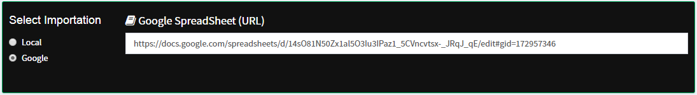

# Import data

Una vez colectado los datos, de acuerdo a lo diseñado en _FieldBook Plan_ deberá de ser importado a **FieldBooQ** como url, pegando el link de la hoja de google spreadsheed.



ó como una hoja de *.xlsx desde tu ordenador, considerar en _Sheet_ el numero de hoja del libre que debe leer, si es la primera hoja es 1, si es la segunda es 2, etc.


Una vez cargado el archivo. En ocasiones es muy útil realizar un filtro a la base de datos, para un análisis de solo algunos subniveles. Entonces en la herramienta **Filter** podrás seleccionar de la tabla importada los datos que se deseen procesar.


De no escoger ningun filtro, se procesará la base de datos completa.

<!--
```{r, eval=FALSE}
<iframe width="560", height="315", src="https://www.youtube.com/watch?v=xSLer7p_Q5Y", frameborder="0", allowfullscreen ></iframe>
```

-->


