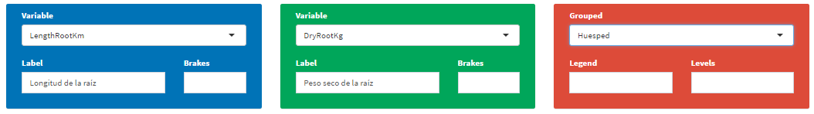
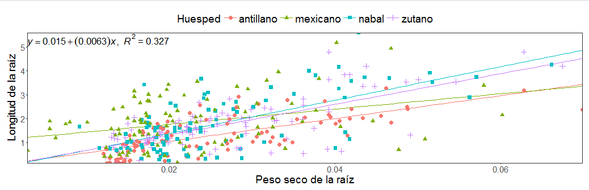

# Regression

En regresion se puede construir modelos de regresion lineal simple, seleccionando las variables respuesta en la caja azul y verde, para el eje de las ordenas y abscisas respectivamente.

Seguidamente se vizualizará  la gráfica lineal, la ecuación y el coeficiente de correlación  r**2  de Pearson 

